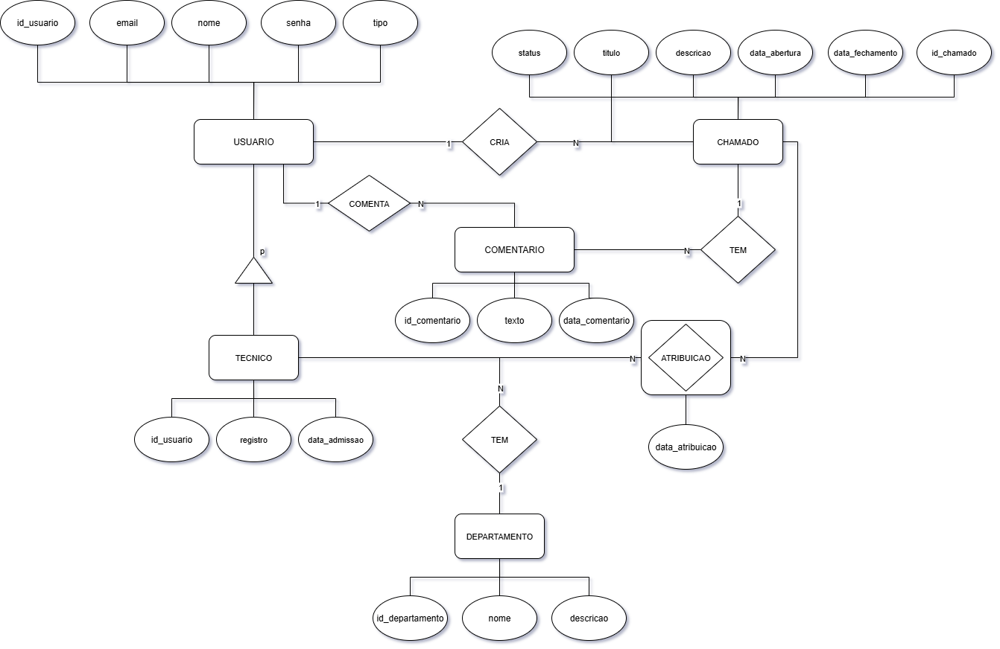

# Projeto de Banco de Dados - UFMA
> Sistema de Chamados

**Disciplina:** Banco de Dados
**Professora:** Vandecia Rejane Monteiro Fernandes
**Aluno:** Kevin Silva Rodrigues
**Data:** Julho 2025

## Descrição do Trabalho

Este trabalho consiste no desenvolvimento de um sistema de chamados para atendimento ao cliente, contemplando:
- Modelagem de dados (Diagrama ER);
- Implementação de banco de dados PostgreSQL;
- Criação de funções e triggers para automação de estatísticas;
- Consultas avançadas com agregação e cláusula HAVING;
- Garantia de integridade referencial.

## Objetivos

- Implementar modelo relacional seguindo as normas de normalização;
- Automatizar o cálculo de estatísticas de resolução de chamados;
- Prover relatórios e consultas para análise de desempenho;
- Demonstrar uso de PostgreSQL e SQL avançado.

## Funcionalidades

- Cadastro de usuários (Clientes e Técnicos);
- Gerenciamento de departamentos;
- Abertura, atribuição e fechamento de chamados;
- Registro de comentários em chamados;
- Cálculo da média de dias para resolução de chamados por técnico.

## Diagrama ER

O diagrama entidade-relacionamento do sistema de chamados está disponível em:


## Pré-requisitos

- Docker (versão 20.10+)
- Docker Compose (versão 1.29+)

## Estrutura do projeto

```
consulta-agregada.sql          # Consultas com funções de agregação
consulta-having.sql            # Consultas com cláusula HAVING
criar-tabelas.sql              # Cria tabelas e relacionamentos
funcao-trigger.sql             # Cria funções e triggers de negócio
populando-tabelas.sql          # Insere dados iniciais
docker-compose.yml             # Configuração do container PostgreSQL
digrama-er-sistema-chamados.png # Diagrama ER do sistema
```

## Como executar

1. Clone este repositório:

```bash
git clone https://github.com/AntiKevin/projeto-bd-ufma.git
cd projeto-bd-ufma
```

2. (Opcional) Crie a pasta `sql` e mova os arquivos `.sql` para dentro dela, caso deseje que a inicialização automática via Docker Compose funcione:

```bash
mkdir sql && mv *.sql sql/
```

3. Inicie o container do PostgreSQL:

```bash
docker-compose up -d
```

4. Verifique se o container está em execução:

```bash
docker-compose ps
```

### Execução manual dos scripts SQL

Caso não tenha movido os arquivos para a pasta `sql` ou prefira executar manualmente:

```bash
docker-compose exec postgres psql -U kevin -d sistema_chamados -f criar-tabelas.sql
docker-compose exec postgres psql -U kevin -d sistema_chamados -f populando-tabelas.sql
docker-compose exec postgres psql -U kevin -d sistema_chamados -f funcao-trigger.sql
docker-compose exec postgres psql -U kevin -d sistema_chamados -f consulta-agregada.sql
docker-compose exec postgres psql -U kevin -d sistema_chamados -f consulta-having.sql
```

## Ordem de execução dos scripts

1. `criar-tabelas.sql`
2. `populando-tabelas.sql`
3. `funcao-trigger.sql`
4. `consulta-agregada.sql`
5. `consulta-having.sql`
