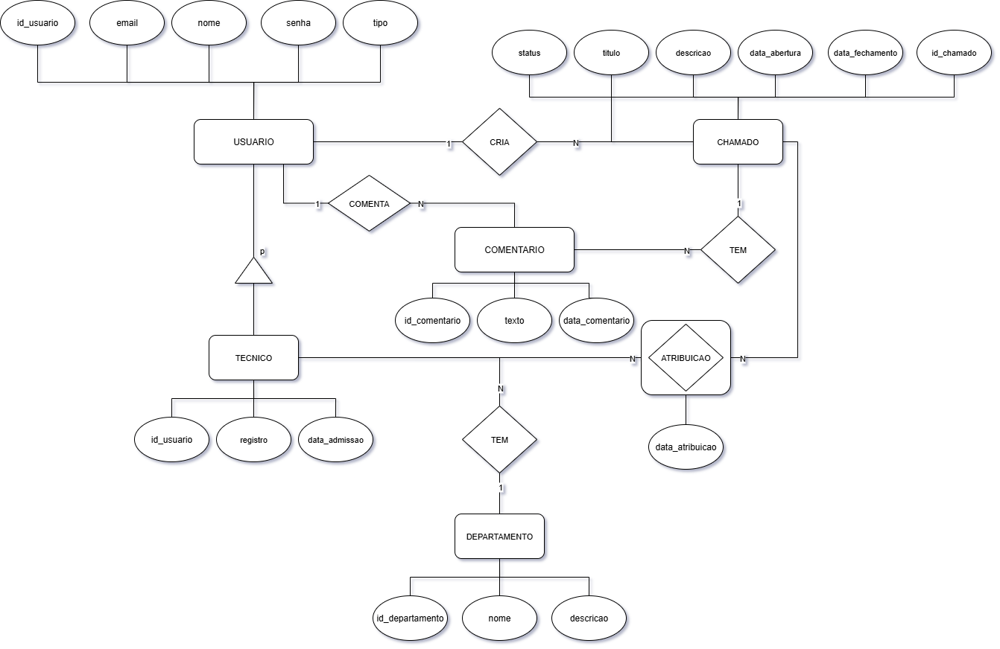

# Projeto de Banco de Dados - UFMA


> Sistema de Chamados

## Descrição do Trabalho

**Disciplina:** Banco de Dados <br>
**Professora:** Vandecia Rejane Monteiro Fernandes <br>
**Aluno:** Kevin Silva Rodrigues <br>
**Data:** Julho 2025 <br>

Este trabalho consiste no desenvolvimento de um sistema de chamados para atendimento ao cliente, contemplando:
- Modelagem de dados (Diagrama ER);
- Implementação de banco de dados PostgreSQL;
- Criação de funções e triggers para automação de estatísticas;
- Consultas avançadas com agregação e cláusula HAVING;
- Garantia de integridade referencial.

## Objetivos

- Implementar modelo relacional seguindo as normas de normalização;
- Automatizar o cálculo de estatísticas de resolução de chamados;
- Prover relatórios e consultas para análise de desempenho;
- Demonstrar uso de PostgreSQL e SQL avançado.

## Funcionalidades

- Cadastro de usuários (Clientes e Técnicos);
- Gerenciamento de departamentos;
- Abertura, atribuição e fechamento de chamados;
- Registro de comentários em chamados;
- Cálculo da média de dias para resolução de chamados por técnico.

## Diagrama ER

O diagrama entidade-relacionamento do sistema de chamados está disponível em:


## Pré-requisitos

- Docker (versão 20.10+)
- Docker Compose (versão 1.29+)

## Estrutura do Projeto

```text
/
├── BD20251_P3.pdf               # Enunciado do trabalho
├── docker-compose.yml           # Configuração do container PostgreSQL
├── diagramas/
│   └── digrama-er-sistema-chamados.png  # Diagrama ER do sistema
├── sql/
│   ├── criar-tabelas.sql        # Cria tabelas e relacionamentos
│   ├── populando-tabelas.sql    # Insere dados iniciais
│   ├── funcao-trigger.sql       # Funções e triggers de negócio
│   ├── consulta-agregada.sql    # Consultas com funções de agregação
│   └── consulta-having.sql      # Consultas com cláusula HAVING
└── README.md                    # Documentação e instruções
```

## Como executar

1. Clone este repositório:

```bash
git clone https://github.com/AntiKevin/projeto-bd-ufma.git
cd projeto-bd-ufma
```

- Opcional: Verifique se a pasta `sql/` possui todos os scripts necessários.

2. Inicie o container do PostgreSQL:

```bash
docker-compose up -d
```

3. Verifique se o container está em execução:

```bash
docker-compose ps
```

### Execução manual dos scripts SQL

Caso queira executar manualmente cada script (já dentro do container):

```bash
docker-compose exec postgres psql -U kevin -d sistema_chamados -f sql/criar-tabelas.sql
docker-compose exec postgres psql -U kevin -d sistema_chamados -f sql/populando-tabelas.sql
docker-compose exec postgres psql -U kevin -d sistema_chamados -f sql/funcao-trigger.sql
docker-compose exec postgres psql -U kevin -d sistema_chamados -f sql/consulta-agregada.sql
docker-compose exec postgres psql -U kevin -d sistema_chamados -f sql/consulta-having.sql
```

## Ordem de execução dos scripts

1. `criar-tabelas.sql`
2. `populando-tabelas.sql`
3. `funcao-trigger.sql`
4. `consulta-agregada.sql`
5. `consulta-having.sql`
